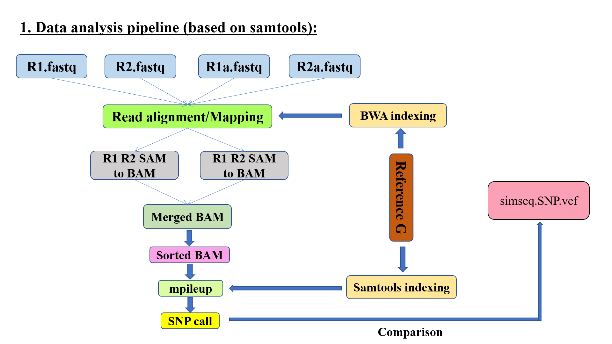
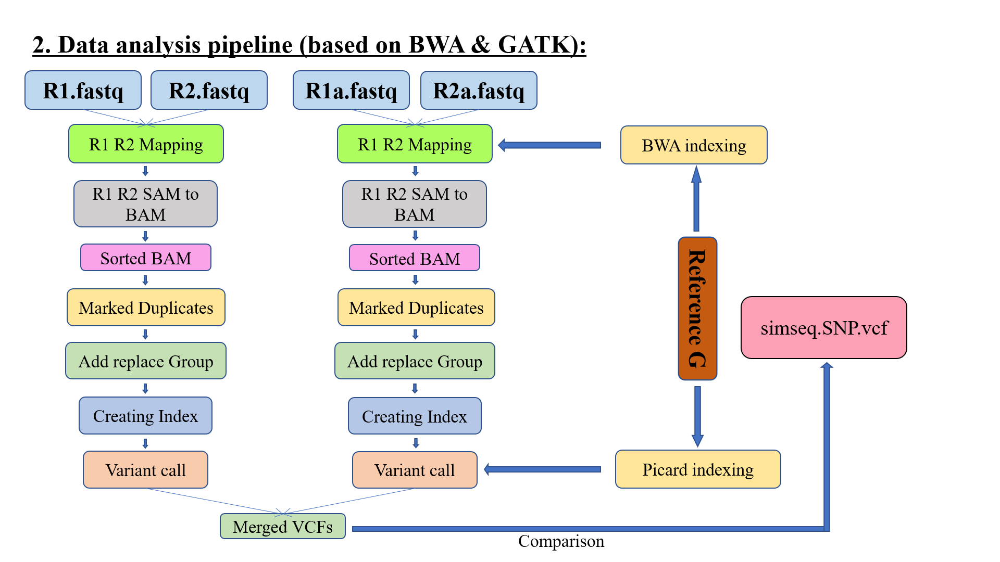

# Variant calling pipelines for the beginners

**Variant Calling:**

Variant calling is the mechanism through which variants from the sequence data are found. This process can be exicuted in to three steps. Those steps are given below.
+ Execute entire genome or exome sequences to create FASTQ files.
+ Align the sequences by generating BAM or CRAM files to a reference genome.
+ Identify and write to a VCF file where the aligned reads differ from the reference genome.

This pipeline will show you how to make a variant call step by step using different publickly available tools.
Initially a .sh file will be given which contains a newly build variant calling pipeline.
Gradually the whole section will be illustrated.

**1. TOOLS**

There are lots of available tools for varient calling. Some combination of tools produces best variant call result.
In this section I enlist the tools which are used for variant calling operation.

+ **GATK** (*Download Url: https://github.com/broadinstitute/gatk*)
+ **picard** (*Download Url: https://github.com/broadinstitute/picard*)
+ **samtools** (*Download Url: https://github.com/samtools/samtools*)
+ **bwa** (*Download Url: https://github.com/lh3/bwa*)
+ **bamtools** (*Download Url: https://github.com/pezmaster31/bamtools*)
+ **FastQC** (*Download Url: https://github.com/s-andrews/FastQC*)
+ **MultiQC** (*Download Url: https://github.com/ewels/MultiQC*)

In most cases, these packages can be downloaded and built using this pattern:

+ **GATK**  

The goal of GATK4 is to bring together well-established GATK and Picard codebase tools within a streamlined framework and to enable selected tools to run massively parallel on local clusters or in the cloud using Apache Spark.

 *Quick Start Guide*
~~~
Build the GATK: ./gradlew bundle (creates gatk-VERSION.zip in build/)
Get help on running the GATK: ./gatk --help
Get a list of available tools: ./gatk --list
Run a tool: ./gatk PrintReads -I src/test/resources/NA12878.chr17_69k_70k.dictFix.bam -O output.bam
Get help on a particular tool: ./gatk PrintReads --help
~~~

+ **picard**

Using the HTSJDK Java library HTSJDK, Picard supports accessing file formats widely used for high-throughput sequencing data such as SAM and VCF.

Building Picard
First, clone the repo:
~~~
$ git clone https://github.com/broadinstitute/picard.git
$ cd picard/
~~~    
Picard is now built using gradle. A wrapper script (gradlew) is included which will download the appropriate version of gradle on the first invocation.

To build a fully-packaged, runnable Picard jar with all dependencies included, run:
~~~
$ ./gradlew shadowJar
~~~
The resulting jar will be in build/libs. To run it, the command is:
~~~   
$ java -jar build/libs/picard.jar
   or  
$ java -jar build/libs/picard-<VERSION>-all.jar 
~~~   
To build a jar containing only Picard classes (without its dependencies), run:
~~~
$ ./gradlew jar 
~~~

+ **samtools**

SAMtools is a set of utilities for interacting with and post-processing short DNA sequence read alignments in the SAM (Sequence Alignment/Map), BAM (Binary Alignment/Map) and CRAM formats, written by Heng Li. These files are generated as output by short read aligners like BWA.

To build and install Samtools, 'cd' to the samtools-1.x directory containing
the package's source and type the following commands:
~~~  
$ ./configure
$ make
$ make install
~~~      
    
+ **bwa**

BWA is a software package for mapping DNA sequences against a large reference genome, such as the human genome. It consists of three algorithms: BWA-backtrack, BWA-SW and BWA-MEM. 

To build and install bwa, 'cd' to the bwa directory containing the package's source and type 'make'.
~~~
$ git clone https://github.com/lh3/bwa.git 
$ cd bwa; make
~~~

+ **bamtools**

bamtools is a project that includes both a C++ API and a toolkit for reading, writing and editing BAM (genome alignment) files on command line.

To build and install bamtools type the following commands given below.
~~~
$ mkdir build
$ cd build
$ cmake -DCMAKE_INSTALL_PREFIX=/my/install/dir ..
$ make
$ make DESTDIR=/my/stage/dir install
~~~  

**2. DATA SETS**

+ *Raw Data sets*

A slanderous practice data set is provided here to run the entire variance calling the pipeline. The user can easily download the entire data set on their local server and run the pipeline easily.

 **Sample:** *Sample_U0a*
 **Project:** *Project_RM8398*
 **Sequencer:** *HiSeq_300x*
 **Download Url:** 

ftp://ftp-trace.ncbi.nlm.nih.gov/giab/ftp/data/NA12878/NIST_NA12878_HG001_HiSeq_300x/131219_D00360_005_BH814YADXX/Project_RM8398/Sample_U0a/

+ *Reference data set*

A reference genome (also known as a reference assembly) is a database of the digital nucleic acid sequence, assembled by scientists as a representative example of a set of genes for a species. In this pipeline I have used GRCh38 for mapping the fastq files.

Download Url: https://www.ncbi.nlm.nih.gov/grc/human

+ *SNP data set*

Another essential thing that is needed for variant calling is the SNP database. A download link for downloading the SNP database is provided here below. 

Download Url: ftp://ftp.ncbi.nlm.nih.gov/snp/organisms/human_9606_b151_GRCh38p7/VCF/

**3. Basic workflow of this pipeline**

This pipeline works very simply, executing various functions from different packages, step by step. The novices just need to understand the functionality of those functions. After a few successful executions of this pipeline with different data sets, it will be more flexible for the user to control input arguments that are needed for these functions. Initially the user only require to change tha path of those data sets and run the pipeline using the command given below.

+ 1. Take a look at the FASTQ file

It is required to put a glance in the Fastq files. After that continue the processing. 

~~~
$ ./variantCaller_v2.sh
~~~

**4. Other Pipelines for variant call**

Here, two more pipelines are included, which are very simple pipelines for calling variants.
The name of those pipelines are 1) BWA_samtools_bcftools.sh and 2) BWA_Gatk_v2.sh.

**5. BWA, Samtools and Bcftools based pipeline**

**6. BWA and Gatk based pipeline**

